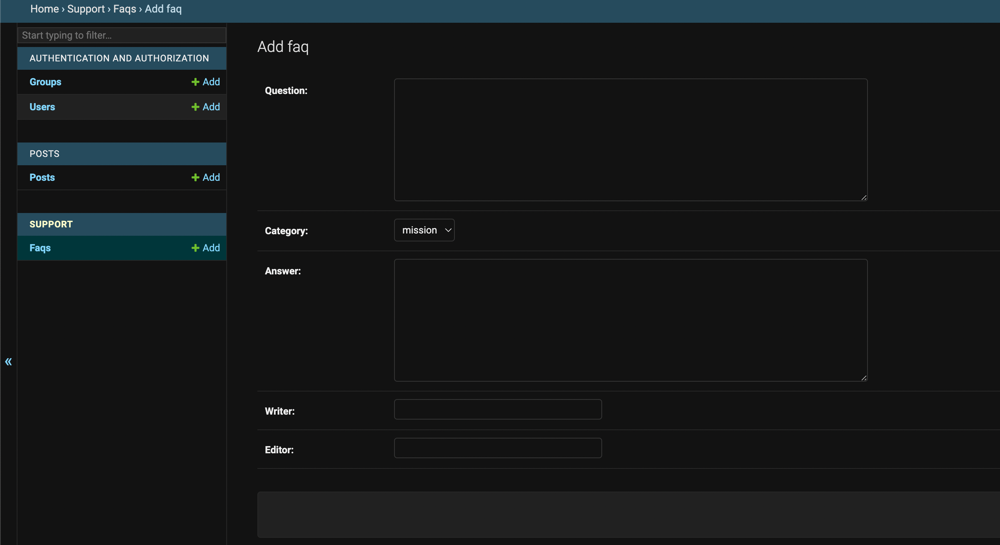

# Mission 3
### 미션 내용 : 고객센터 관리자 페이지 구성하기

- 고객센터 앱의 모델을 관리자페이지에 등록 구성

### 목표

- Models 기반으로 Admin 페이지 구성

### 요구사항

- 고객센터(`support`) 앱의 자주묻는질문(`Faq`), 1:1문의(`Inquiry`), 답변(`Answer`) 관리자 페이지 등록
    - 자주묻는질문(`Faq`)
        - 목록페이지 출력 필드 : 제목, 카테고리, 최종 수정 일시
        - 검색 필드 : 제목
        - 필터 필드 : 카테고리
    - 1:1문의(`Inquiry`)
        - 목록페이지 출력 필드 : 질문 제목, 카테고리, 생성 일시, 생성자
        - 검색 필드 : 제목, 이메일, 전화번호
        - 필터 필드 : 카테고리
        - 인라인모델 : 답변(`Answer`)
    - 답변(`Answer`)
        - 1:1문의 모델에 인라인모델로 추가

### 힌트

- 관리자 옵션 공식문서 : [https://docs.djangoproject.com/en/4.0/ref/contrib/admin/#modeladmin-options](https://docs.djangoproject.com/en/4.0/ref/contrib/admin/#modeladmin-options)

### 결과 캡처화면
  
  
 